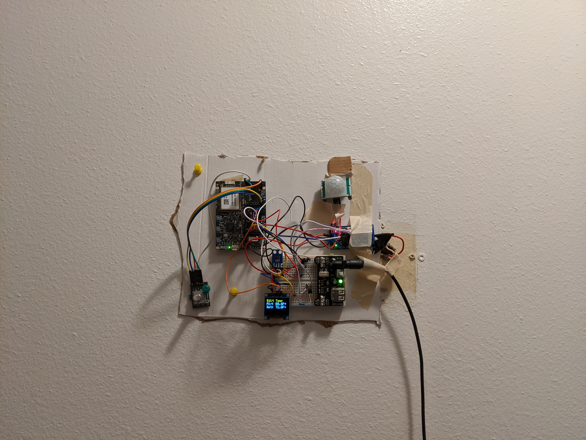
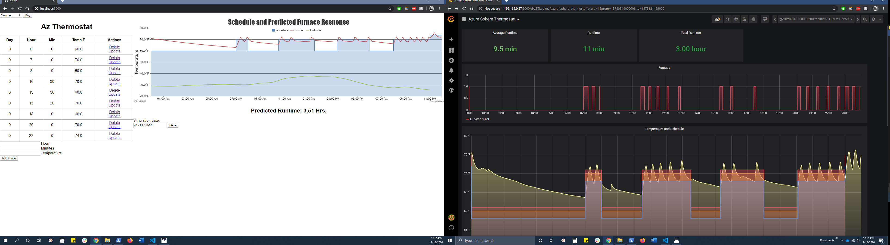
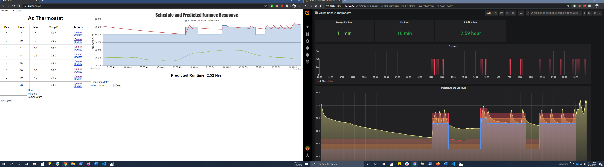
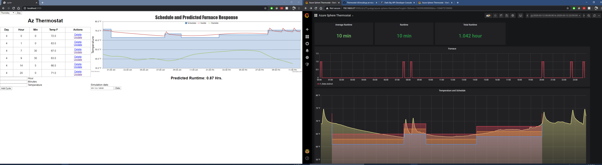
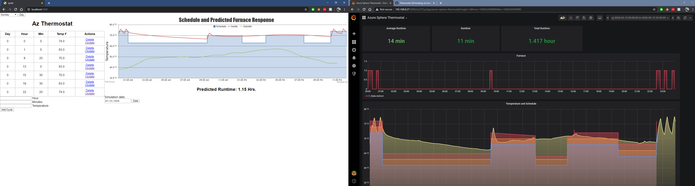

# AzSphereThermostat
## By MCRUMP & DROLL

The Azure SphereMT3620 Smart Thermostat was made for a final project for a college course. The idea behind this smart thermostat was to have a schedule that can be configured for each day with any number of cycles per day. I wanted to track how long the furnace ran each day and record the sensor readings. As well, I used a motion detector to automatically turn on and off the screen. The motion detector also puts the furnace into a baseline mode (ignoring the set schedule) if no motion is detected for a set period of time. The thermostat can be manually set into a temporary mode or adjusted through the web page hosted on a Raspberry Pi 4. The Pi also saves the sensor readings to a database through Influxdb and displayed by Grafana. (the furnace at my duplex only has heating and the fan is controlled by it so I only had the option of implementing just heat, no fan nor AC) Nothing too unique about this thermostat other than the motion detection which will automatically turn the furnace down to a base line temperature until movement is detected again (this happens after an adjustable period, say 1-6 days).

I think where this project shines is on the web server side. The server not only saves and allows configuration of the schedule, but also provides a prediction of the inside temperature along with how long the furnace might run for. I broke out my old physics textbook and found some equations to help model this. I take in the local weather for said day along with the schedule and run it through the model. This calculates what the inside temperature will be (and attic temperature) as well as when the furnace runs. At first this was not too accurate as I did not take into account how sunlight can heat up the home, once I added the UV index into the model this gave a fairly accurate prediction to my surprise. But it became more accurate once I took the wall I share with my neighbor into account. Now the prediction is within 5-20 minutes of the actual runtime, the thing throwing it a little off now, depends on how long we are home or have guests over, if the oven is on and if the computers have been running all day. This is hard to account for so I called it good enough here. (see screenshots for the predicted runtime vs actual recorded data)

|           | 
|:-------------------------------:|
| Azure Sphere Thermostat |

|           | 
|:-------------------------------:|
| Januarly 3rd 2020 |

|           | 
|:-------------------------------:|
| February 1st 2020 |

|           | 
|:-------------------------------:|
| March 12th 2020 |

|           | 
|:-------------------------------:|
| March 15th 2020 |
